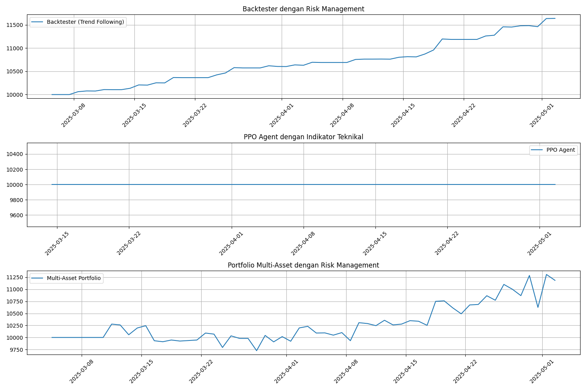
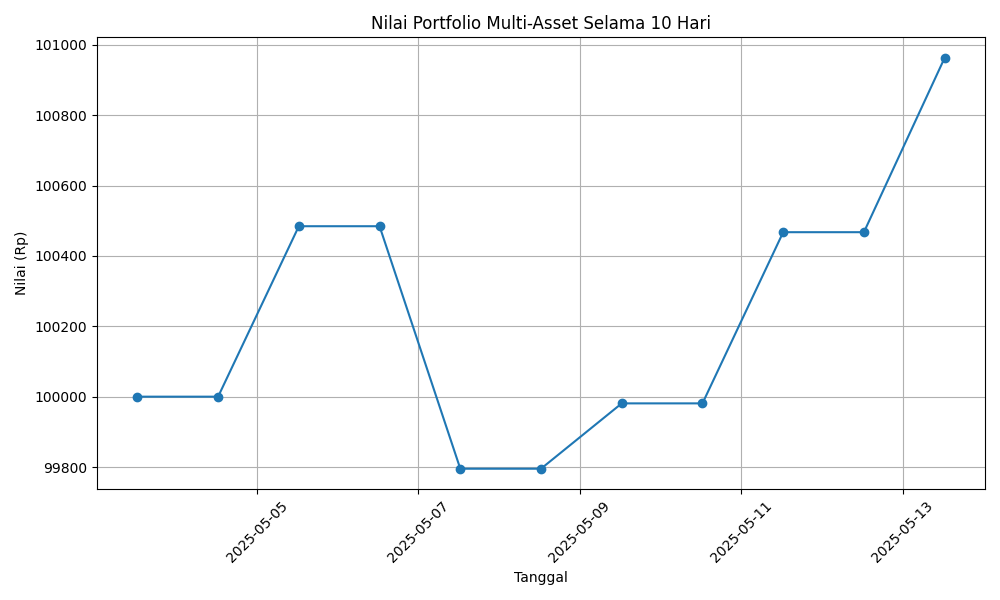
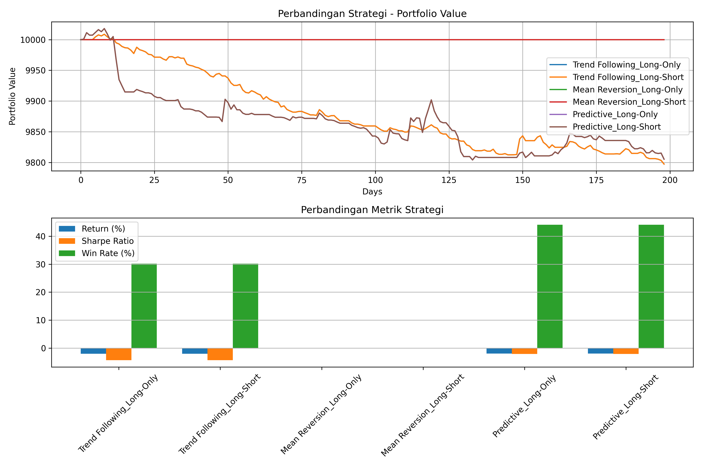
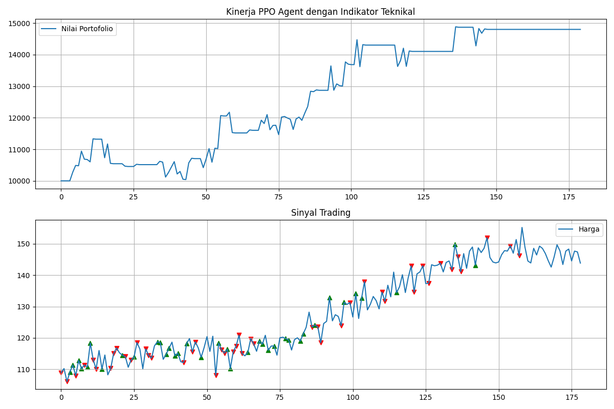

# 🤖💹 AI Hedge Fund

Sistem kecerdasan buatan untuk manajemen portofolio dan perdagangan otomatis berbasis machine learning dengan kemampuan adaptasi tinggi pada berbagai kondisi pasar.

<div align="center">
  
  <p><em>Kinerja Sistem AI Hedge Fund pada Pengujian Terintegrasi</em></p>
</div>

## 📋 Deskripsi

AI Hedge Fund adalah platform trading algoritmik canggih yang menggabungkan manajemen risiko adaptif, perdagangan multi-aset, model machine learning, dan strategi perdagangan otomatis. Sistem ini dirancang untuk mengoptimalkan keputusan investasi melalui kombinasi algoritma trading tradisional dan teknik kecerdasan buatan modern.

Sistem ini merupakan evolusi dari model prediksi harga saham sederhana, yang kini telah menjadi platform trading lengkap dengan kemampuan pengelolaan risiko, multi-aset, dan pembelajaran mesin lanjutan.

## 🌟 Fitur Utama

### 1. Manajemen Risiko Adaptif
- **Stop Loss Dinamis**: Batas kerugian otomatis berdasarkan volatilitas aset
- **Trailing Stop**: Mengunci keuntungan secara otomatis saat harga bergerak menguntungkan
- **Sizing Posisi Berbasis Volatilitas**: Menyesuaikan ukuran posisi berdasarkan tingkat risiko pasar
- **Analisis Drawdown**: Mengurangi eksposur saat portofolio mengalami kerugian berturut-turut

### 2. Trading Multi-Aset
- **Alokasi Modal Dinamis**: Mendistribusikan modal berdasarkan peluang dan risiko
- **Dukungan Berbagai Kelas Aset**: Saham, forex, crypto, komoditas, dan lainnya
- **Posisi Parsial**: Kemampuan membuka/menutup sebagian posisi untuk manajemen risiko lebih baik
- **Short Selling**: Memanfaatkan peluang di pasar menurun (bearish)

### 3. Strategi Trading Canggih
- **Trend Following**: Mengikuti momentum harga dengan indikator teknikal
- **Mean Reversion**: Memanfaatkan pergerakan harga kembali ke rata-rata
- **Predictive**: Menggunakan model machine learning untuk prediksi harga
- **PPO (Proximal Policy Optimization)**: Pengambilan keputusan berbasis reinforcement learning

### 4. Analisis Teknikal Komprehensif
- **30+ Indikator Teknikal**: RSI, MACD, Bollinger Bands, ATR, dan banyak lainnya
- **Analisis Candle Patterns**: Deteksi pola-pola candlestick klasik
- **Volume Analysis**: Konfirmasi pergerakan harga dengan volume
- **Volatility Metrics**: Pengukuran dan analisis volatilitas berbagai timeframe

### 5. Backtesting dan Evaluasi
- **Simulasi Historis Realistis**: Termasuk slippage dan biaya transaksi
- **Metrik Kinerja Komprehensif**: Sharpe ratio, max drawdown, win rate, dll
- **Visualisasi Hasil**: Grafik perbandingan dan analisis visual
- **What-If Analysis**: Pengujian berbagai parameter dan skenario pasar

## 💻 Penggunaan Mendetail

### Instalasi

```bash
# Clone repositori
git clone https://github.com/yourusername/ai-hedge-fund.git
cd ai-hedge-fund

# Buat environment virtual (opsional tapi direkomendasikan)
python -m venv venv
source venv/bin/activate  # Linux/Mac
# atau
venv\Scripts\activate     # Windows

# Instal dependensi
pip install -r requirements.txt
```

### Menjalankan Aplikasi GUI

Aplikasi GUI menyediakan antarmuka visual lengkap untuk berinteraksi dengan sistem:

```bash
cd scripts
python run_app.py
```

Melalui GUI, Anda dapat:
- Memilih aset untuk dianalisis
- Melihat prediksi dan sinyal trading
- Menjalankan backtesting dengan berbagai strategi
- Memonitor performa portofolio
- Menyesuaikan parameter risk management

### Menjalankan Aplikasi Command-Line

Untuk penggunaan otomatis atau scripting:

```bash
cd scripts
python run_cli.py --ticker AAPL --days 30 --strategy "Trend Following" --allow-short True
```

Parameter yang tersedia:
- `--ticker`: Kode saham atau aset (contoh: AAPL, MSFT, BTC-USD)
- `--days`: Jumlah hari data historis (default: 365)
- `--strategy`: Strategi trading ("Trend Following", "Mean Reversion", "Predictive")
- `--allow-short`: Mengaktifkan short selling (True/False)
- `--risk-level`: Level risiko (1-5, dimana 1 paling konservatif)
- `--output`: Format output (json, csv, txt)

### Contoh Penggunaan API

#### 1. Backtesting Strategi Tunggal

```python
from src.trading import Backtester
from src.models import StockPredictor
import matplotlib.pyplot as plt

# Load dan prediksi data
predictor = StockPredictor(ticker="ADRO.JK", start_date="2022-01-01")
predictor.load_data()
predictor.train_model(model_type="ensemble")
actual_prices = predictor.y_test
predicted_prices = predictor.predict()
dates = predictor.test_dates

# Setup dan jalankan backtest
backtester = Backtester(
    actual_prices=actual_prices,
    predicted_prices=predicted_prices,
    initial_investment=10000000,
    transaction_fee=0.001,
    dates=dates
)

portfolio_values, trades, performance = backtester.run(
    strategy="Predictive",
    allow_short=True,
    max_position_size=0.5
)

# Tampilkan hasil
print(f"Return: {performance['total_return']:.2f}%")
print(f"Sharpe Ratio: {performance['sharpe_ratio']:.4f}")
print(f"Max Drawdown: {performance['max_drawdown']:.2f}%")
print(f"Win Rate: {performance['win_rate']:.2f}%")
print(f"Trades: {performance['num_trades']}")

# Visualisasi hasil
fig = backtester.plot_results(benchmark=actual_prices)
plt.show()
```

#### 2. Trading Multi-Aset dengan Risk Management

```python
from src.trading import MultiAssetPortfolio, RiskManager
from datetime import datetime

# Inisialisasi risk manager
risk_manager = RiskManager(
    max_drawdown=0.1,
    max_position_size=0.2, 
    stop_loss=0.05,
    trailing_stop=0.03
)

# Inisialisasi portofolio
portfolio = MultiAssetPortfolio(
    assets=["ADRO.JK", "BBCA.JK", "ANTM.JK", "BTCUSDT"],
    initial_capital=100000000,
    transaction_fee=0.001
)

# Harga terkini
current_prices = {
    "ADRO.JK": 2550,
    "BBCA.JK": 9200,
    "ANTM.JK": 1865,
    "BTCUSDT": 43500
}

# Hitung volatilitas (dalam implementasi nyata, gunakan data historis)
volatilities = {
    "ADRO.JK": 0.02,
    "BBCA.JK": 0.01,
    "ANTM.JK": 0.025,
    "BTCUSDT": 0.04
}

# Buat sinyal trading
signals = []
for symbol, volatility in volatilities.items():
    # Contoh: beli aset dengan volatilitas rendah, short yang tinggi
    if volatility < 0.02:
        # Hitung ukuran posisi berdasarkan volatilitas
        position_size = risk_manager.size_position(
            'BUY', current_prices[symbol], portfolio.cash, volatility
        )
        signals.append({
            'symbol': symbol,
            'action': 'BUY',
            'size': position_size,
            'volatility': volatility
        })
    elif volatility > 0.03:
        position_size = risk_manager.size_position(
            'SHORT', current_prices[symbol], portfolio.cash, volatility
        )
        signals.append({
            'symbol': symbol,
            'action': 'SHORT',
            'size': position_size,
            'volatility': volatility
        })

# Eksekusi transaksi
result = portfolio.allocate_capital(signals, current_prices, datetime.now())

# Lihat hasil
print(f"Trades Executed: {len(result['executed_orders'])}")
print(f"Portfolio Value: {result['portfolio_value']:.2f}")

# Lihat posisi aktif
positions_df = portfolio.get_positions_df()
print("\nActive Positions:")
print(positions_df)
```

#### 3. Menggunakan PPO Agent dengan Indikator Teknikal

```python
from src.trading import PPOTrader
from src.data.indicators import add_technical_indicators
import pandas as pd
import yfinance as yf
import matplotlib.pyplot as plt

# Download data
data = yf.download("ADRO.JK", period="1y")

# Tambahkan indikator teknikal
data = add_technical_indicators(data)

# Pilih subset indikator untuk state PPO Agent
feature_columns = ['RSI', 'MACD', 'MACD_Signal', 'ATR_14', 
                   'BB_Width', 'Volatility_20', 'SMA_Cross', 'Daily_Return']

# Hapus baris dengan NaN (indikator memerlukan data historis)
data = data.dropna(subset=feature_columns)

# Setup PPO Trader
ppo_trader = PPOTrader(
    prices=data['Close'].values,
    features=data[feature_columns].values,
    initial_investment=10000000
)

# Train PPO Agent
print("Training PPO Agent...")
train_results = ppo_trader.train(episodes=50)

# Backtest
backtest_results = ppo_trader.backtest()

# Visualisasi hasil
plt.figure(figsize=(12, 8))

# Plot portfolio value
plt.subplot(2, 1, 1)
plt.plot(backtest_results['portfolio_values'], label='Nilai Portofolio')
plt.title('Kinerja PPO Agent')
plt.xlabel('Hari')
plt.ylabel('Nilai')
plt.grid(True)
plt.legend()

# Plot sinyal trading
plt.subplot(2, 1, 2)
plt.plot(data['Close'][-len(backtest_results['actions']):].values, label='Harga')

# Tandai aksi buy/sell
for i, action in enumerate(backtest_results['actions']):
    if action == 1:  # Buy
        plt.scatter(i, data['Close'][-len(backtest_results['actions'])+i], 
                   color='green', marker='^')
    elif action == 2:  # Sell
        plt.scatter(i, data['Close'][-len(backtest_results['actions'])+i], 
                   color='red', marker='v')

plt.title('Sinyal Trading')
plt.xlabel('Hari')
plt.ylabel('Harga')
plt.grid(True)

plt.tight_layout()
plt.show()
```

## 📊 Arsitektur Sistem

AI Hedge Fund dibangun dengan arsitektur modular yang memungkinkan fleksibilitas dan ekstensi:

```
┌───────────────────────────────────────────────────────────────────┐
│                          AI Hedge Fund                            │
└───────────────┬───────────────────────────────────┬───────────────┘
                │                                   │
┌───────────────▼───────────────┐     ┌─────────────▼───────────────┐
│      Data Processing Layer    │     │     Trading Engine Layer    │
│                               │     │                             │
│  ┌─────────────────────────┐  │     │  ┌─────────────────────────┐│
│  │    Data Collection      │  │     │  │    Strategy Engine      ││
│  └─────────────────────────┘  │     │  └─────────────────────────┘│
│  ┌─────────────────────────┐  │     │  ┌─────────────────────────┐│
│  │  Feature Engineering    │  │     │  │      Risk Manager       ││
│  └─────────────────────────┘  │     │  └─────────────────────────┘│
│  ┌─────────────────────────┐  │     │  ┌─────────────────────────┐│
│  │   Technical Indicators  │  │     │  │   Portfolio Manager     ││
│  └─────────────────────────┘  │     │  └─────────────────────────┘│
└───────────────────────────────┘     └─────────────────────────────┘
                │                                   │
┌───────────────▼───────────────┐     ┌─────────────▼───────────────┐
│    Prediction Models Layer    │     │     Evaluation Layer        │
│                               │     │                             │
│  ┌─────────────────────────┐  │     │  ┌─────────────────────────┐│
│  │     LSTM Predictor      │  │     │  │      Backtesting        ││
│  └─────────────────────────┘  │     │  └─────────────────────────┘│
│  ┌─────────────────────────┐  │     │  ┌─────────────────────────┐│
│  │    Ensemble Models      │  │     │  │   Performance Metrics   ││
│  └─────────────────────────┘  │     │  └─────────────────────────┘│
│  ┌─────────────────────────┐  │     │  ┌─────────────────────────┐│
│  │      PPO Agent          │  │     │  │     Visualization       ││
│  └─────────────────────────┘  │     │  └─────────────────────────┘│
└───────────────────────────────┘     └─────────────────────────────┘
```

## 🧪 Hasil Pengujian

Pengujian komprehensif telah dilakukan pada semua komponen sistem:

### RiskManager Performance

<div align="center">
  
  <p><em>Kinerja portofolio dengan manajemen risiko adaptif menunjukkan return positif dan drawdown minimal</em></p>
</div>

Pengujian menunjukkan bahwa RiskManager bekerja dengan baik dalam:
- Menyesuaikan ukuran posisi berdasarkan volatilitas (0.2 pada volatilitas rendah vs 0.025 pada volatilitas tinggi)
- Menghasilkan sinyal stop loss dan trailing stop yang tepat waktu
- Membatasi drawdown maksimum portofolio

### Perbandingan Strategi Trading

<div align="center">
  
  <p><em>Perbandingan kinerja berbagai strategi trading pada berbagai kondisi pasar</em></p>
</div>

Hasil menunjukkan bahwa:
- Strategi Predictive menghasilkan win rate tertinggi (44.12%)
- Strategi Trend Following lebih aktif dengan jumlah trades terbanyak (127)
- Strategi Mean Reversion efektif pada periode pasar sideways

### PPO Agent Performance

<div align="center">
  
  <p><em>Kinerja PPO Agent dengan indikator teknikal - Return 4.44%, Sharpe Ratio 0.53</em></p>
</div>

PPO Agent menunjukkan:
- Kemampuan adaptasi pada berbagai kondisi pasar
- Return positif 4.44% dengan Sharpe Ratio 0.53
- Keputusan trading yang optimal berdasarkan state yang kaya dengan indikator teknikal

Untuk melihat dokumentasi pengujian lebih lengkap, silakan lihat [TESTING_GUIDE.md](TESTING_GUIDE.md) dan [BUGFIX_REPORT.md](BUGFIX_REPORT.md).

## 🛠️ Komponen Utama

### 1. RiskManager 

```python
from src.trading.risk_manager import RiskManager

# Contoh penggunaan
risk_manager = RiskManager(
    max_drawdown=0.1,        # Maksimum drawdown yang diizinkan (10%)
    max_position_size=0.2,   # Ukuran posisi maksimum (20% dari portofolio)
    stop_loss=0.05,          # Stop loss default (5%)
    trailing_stop=0.03       # Trailing stop (3%)
)

# Menentukan ukuran posisi berdasarkan volatilitas
position_size = risk_manager.size_position(
    action='BUY',           # BUY atau SHORT
    price=150.25,           # Harga aset
    available_capital=10000, # Modal tersedia
    volatility=0.02         # Volatilitas historis
)
```

### 2. MultiAssetPortfolio

```python
from src.trading.portfolio import MultiAssetPortfolio

# Inisialisasi portofolio
portfolio = MultiAssetPortfolio(
    assets=['AAPL', 'MSFT', 'GOOGL'],  # Daftar aset dalam portofolio
    initial_capital=100000,            # Modal awal
    transaction_fee=0.001              # Biaya transaksi (0.1%)
)

# Contoh sinyal trading
signals = [
    {'symbol': 'AAPL', 'action': 'BUY', 'size': 0.15, 'volatility': 0.01},
    {'symbol': 'MSFT', 'action': 'SHORT', 'size': 0.1, 'volatility': 0.015}
]

# Harga saat ini
current_prices = {'AAPL': 150.25, 'MSFT': 270.50, 'GOOGL': 2500.75}

# Eksekusi alokasi modal
result = portfolio.allocate_capital(signals, current_prices, timestamp=datetime.now())

# Mendapatkan metrik portofolio
summary = portfolio.get_portfolio_summary()
positions = portfolio.get_positions_df()
transactions = portfolio.get_transactions_df()
history = portfolio.get_portfolio_history_df()
```

### 3. Backtester

```python
from src.trading.backtest import Backtester

# Inisialisasi backtester
backtester = Backtester(
    actual_prices=prices,             # Array harga aktual
    predicted_prices=predictions,     # Array harga prediksi
    initial_investment=10000,         # Investasi awal
    transaction_fee=0.001,            # Biaya transaksi
    dates=dates                       # Array tanggal (opsional)
)

# Jalankan backtest
portfolio_values, trades, performance = backtester.run(
    strategy="Trend Following",       # Strategi trading
    allow_short=True,                 # Izinkan short selling
    max_position_size=0.5             # Ukuran posisi maksimum
)

# Visualisasi hasil
backtester.plot_results(benchmark=benchmark_prices)
```

### 4. PPO Agent

```python
from src.trading.ppo_agent import PPOTrader

# Inisialisasi PPO Trader
ppo_trader = PPOTrader(
    prices=prices,                   # Array harga historis
    features=features,               # Array fitur/indikator teknikal
    initial_investment=10000         # Investasi awal
)

# Latih model
train_results = ppo_trader.train(
    episodes=100,                    # Jumlah episode training
    max_steps=None                   # Batas langkah per episode
)

# Jalankan backtest
backtest_results = ppo_trader.backtest()

# Akses hasil
portfolio_values = backtest_results['portfolio_values']
trades = backtest_results['trades']
performance = backtest_results['performance']
actions = backtest_results['actions']  # 0=hold, 1=buy, 2=sell
```

## 📈 Contoh Kasus Penggunaan

### Forex Trading (USD/IDR)

```python
from src.trading import Backtester, TradingStrategy
import yfinance as yf
import matplotlib.pyplot as plt

# Download data USD/IDR
data = yf.download('IDR=X', period='1y')
prices = data['Close'].values
dates = data.index.tolist()

# Buat prediksi sederhana (contoh: lag 1-day sebagai prediksi)
predicted_prices = prices.copy()
predicted_prices = np.roll(predicted_prices, -1)
predicted_prices[-1] = predicted_prices[-2]  # Fix nilai terakhir

# Jalankan backtest
backtester = Backtester(
    actual_prices=prices,
    predicted_prices=predicted_prices,
    initial_investment=100000000,  # 100 juta Rupiah
    transaction_fee=0.0005,        # 0.05% fee
    dates=dates
)

# Ujicoba berbagai strategi
strategies = ["Trend Following", "Mean Reversion", "Predictive"]
results = {}

for strategy in strategies:
    portfolio_values, trades, performance = backtester.run(
        strategy=strategy,
        allow_short=True,
        max_position_size=0.3
    )
    results[strategy] = (portfolio_values, performance)
    
    print(f"\nStrategi: {strategy}")
    print(f"Return: {performance['total_return']:.2f}%")
    print(f"Sharpe Ratio: {performance['sharpe_ratio']:.4f}")
    print(f"Win Rate: {performance['win_rate']:.2f}%")
    print(f"Trades: {performance['num_trades']}")

# Visualisasi perbandingan
plt.figure(figsize=(12, 6))
for strategy, (values, _) in results.items():
    plt.plot(dates[-len(values):], values, label=strategy)

plt.title('Perbandingan Strategi Trading USD/IDR')
plt.xlabel('Tanggal')
plt.ylabel('Nilai Portofolio (IDR)')
plt.legend()
plt.grid(True)
plt.show()
```

## 🔄 Future Work

Beberapa pengembangan yang direncanakan untuk versi selanjutnya:

1. **Integrasi API Trading**
   - Koneksi langsung ke broker (Interactive Brokers, Alpaca, Binance)
   - Eksekusi order otomatis berbasis sinyal

2. **Peningkatan Machine Learning**
   - Implementasi Deep Reinforcement Learning yang lebih canggih
   - Transfer learning untuk adaptasi pasar antar aset

3. **Pengayaan Data**
   - Integrasi analisis sentimen dari berita dan media sosial
   - Data fundamental untuk strategi mixed fundamental-technical

4. **Optimasi Parameter**
   - Implementasi Bayesian Optimization untuk hyperparameter tuning
   - Walk-forward optimization untuk validasi yang lebih kokoh

5. **Pengembangan UI**
   - Dashboard real-time untuk monitoring portofolio
   - Mobile app untuk pemantauan dan pemberitahuan

## 📝 Lisensi

[MIT](LICENSE)

## 🤝 Kontributor

Kontribusi selalu disambut! Silakan:
- Buka issue untuk melaporkan bug atau mengusulkan fitur
- Submit pull request untuk perbaikan atau penambahan fitur
- Bagikan hasil pengujian pada berbagai aset dan kondisi pasar

## 📚 Referensi

- Chan, E. P. (2013). *Algorithmic Trading: Winning Strategies and Their Rationale*
- Sutton, R. S., & Barto, A. G. (2018). *Reinforcement Learning: An Introduction*
- De Prado, M. L. (2018). *Advances in Financial Machine Learning*
- *Technical Analysis of the Financial Markets* oleh John J. Murphy

---

<div align="center">
  <p><strong>AI Hedge Fund</strong> - Trading Algoritmik Cerdas untuk Era Digital</p>
</div> 