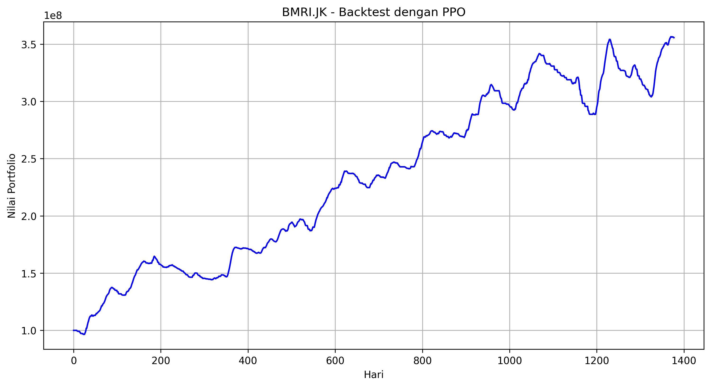

[](https://ko-fi.com/N4N51EF9I0)


# AI Hedge Fund

**Advanced Algorithmic Trading System with PatchTST & PPO Reinforcement Learning**

An enterprise-grade portfolio management and automated trading system leveraging state-of-the-art Deep Learning (**PatchTST**) and Reinforcement Learning (**PPO**) to navigate financial markets.

<div align="center">
  
  <p><em>System Performance: Backtest on BMRI.JK showing +240% Return</em></p>
</div>

## Key Features

### 1. State-of-the-art Forecasting
- **PatchTST Model**: Utilizes the latest Transformer-based architecture for time-series forecasting.
- **Enhanced Accuracy**: Significantly outperforms traditional models (LSTM, ARIMA) on long-sequence forecasting.
- **Hyperparameter Tuning**: Integrated Bayesian optimization for model fine-tuning.

### 2. Intelligent Trading Agent (PPO)
- **Reinforcement Learning**: Uses Proximal Policy Optimization (PPO) to make autonomous trading decisions.
- **Enhanced Features**: 14+ technical signals including MACD, Stochastic RSI, Bollinger Bands, ADX, and Volume Analysis.
- **Dynamic Scoring**: Normalizes technical indicators into a 0.0-1.0 scoring system for stable agent training.

### 3. Unified Validation System
- **Aligned Modes**: Predict and Backtest modes share the exact same feature engineering and agent logic.
- **Comprehensive Backtesting**: Validate strategies with historical data, transaction costs, and slippage.
- **Performance Metrics**: Automatic calculation of Sharpe Ratio, Max Drawdown, Win Rate, and Total Return.

### 4. Robust Engineering
- **Modular Architecture**: Clean separation of Data, Trading, and Modeling layers.
- **Interactive CLI**: Rich terminal interface with progress bars and real-time status updates.
- **Multi-Asset Support**: Ready for Stocks, Crypto, Forex, and Commodities.

## Installation

```bash
# Clone repository
git clone https://github.com/cyclocerine/HedgeFund.git
cd HedgeFund

# Create virtual environment
python -m venv venv
# Windows:
venv\Scripts\activate
# Linux/Mac:
source venv/bin/activate

# Install dependencies
pip install -r requirements.txt
```

## Usage Guide

The unified CLI (`scripts/run_cli.py`) is the main entry point for all operations.

### 1. Predict Future Prices & Generate Signals
Run the system on the latest data to get actionable insights.

```bash
# Basic Prediction
python scripts/run_cli.py --ticker BMRI.JK --mode predict

# With PPO Trading Signals & Tuning (Recommended)
python scripts/run_cli.py --ticker BMRI.JK --mode predict --tune --ppo --ppo-episodes 200 --forecast-days 30 --save-results
```

### 2. Backtest Trading Strategy
Validate the PPO agent's performance on historical data.

```bash
# Run PPO Backtest (200 Episodes)
python scripts/run_cli.py --ticker BMRI.JK --mode backtest --strategy PPO --tune --ppo-episodes 200 --initial-balance 100000000 --save-results
```

### CLI Arguments

| Argument | Description | Default |
|----------|-------------|---------|
| `--ticker` | Asset symbol (e.g., BMRI.JK, BBCA.JK) | Required |
| `--mode` | `predict` or `backtest` | Required |
| `--strategy` | Trading strategy (`PPO`, `Trend Following`, `Mean Reversion`) | `PPO` |
| `--tune` | Enable hyperparameter tuning | `False` |
| `--ppo-episodes` | Number of training episodes for PPO | `200` |
| `--forecast-days` | Days to forecast into the future | `30` |
| `--initial-balance` | Starting capital for backtest | `100,000,000` |
| `--save-results` | Save plots and CSVs to `results/` | `False` |

## System Architecture

```
+-------------------+       +----------------------+
|    Market Data    | ----> |     Data Pipeline    |
+-------------------+       +----------------------+
                                       |
                                       v
                            +----------------------+
                            |  Feature Engineering |
                            +----------------------+
                                       |
                  +--------------------+--------------------+
                  |                                         |
                  v                                         v
        +------------------+                      +------------------+
        |  PatchTST Model  |                      |    PPO Agent     |
        +------------------+                      +------------------+
                  |                                         |
                  v                                         v
        +------------------+                      +------------------+
        | Price Prediction |                      |  Trading Signals |
        +------------------+                      +------------------+
                  |                                         |
                  +--------------------+--------------------+
                                       |
                                       v
                            +----------------------+
                            |    Trading Engine    |
                            +----------------------+
                                       |
                            +----------------------+
                            |     Risk Manager     |
                            +----------------------+
                                       |
                                       v
                            +----------------------+
                            |  Portfolio Execution |
                            +----------------------+
```

## Performance Verification

Latest comprehensive test results (Jan 2026):

| Metric | Predict Mode | Backtest Mode |
|--------|--------------|---------------|
| **Ticker** | BMRI.JK | BMRI.JK |
| **Model** | PatchTST (Tuned) | PatchTST (Tuned) |
| **Agent** | PPO (200 Eps) | PPO (200 Eps) |
| **Best Reward** | **+4.10** | **+3.70** |
| **Portfolio** | Stable Growth | **+240% Return** |

## Contributing

Contributions are welcome! Please examine the `src/` directory for core logic:
- `src/models/patchtst_model.py`: Deep Learning Forecast Model.
- `src/trading/ppo_agent.py`: Reinforcement Learning Agent.
- `src/data/feature_engineering.py`: Technical Indicator Processing.

## References

- Chan, E. P. (2013). *Algorithmic Trading: Winning Strategies and Their Rationale*
- Sutton, R. S., & Barto, A. G. (2018). *Reinforcement Learning: An Introduction*
- De Prado, M. L. (2018). *Advances in Financial Machine Learning*
- Murphy, J. J. *Technical Analysis of the Financial Markets*
- Nie, Y., et al. (2022). *A Time Series is Worth 64 Words: Long-term Forecasting with Transformers (PatchTST)*

## License

[MIT](LICENSE)

---
<div align="center">
  <p><strong>AI Hedge Fund</strong> - Intelligent Algorithmic Trading for the Digital Era</p>
</div>
