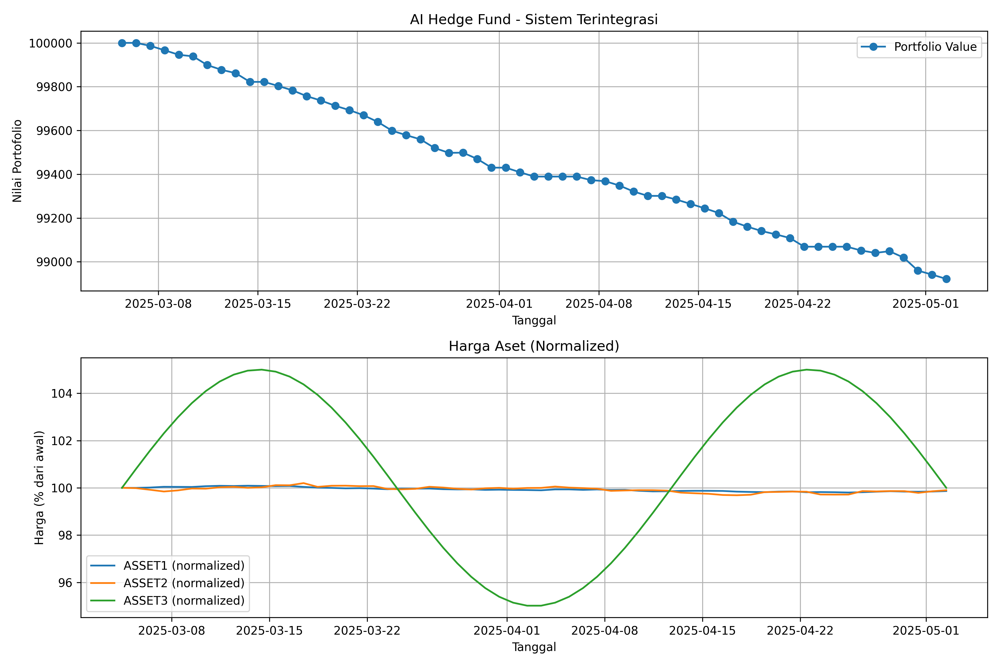
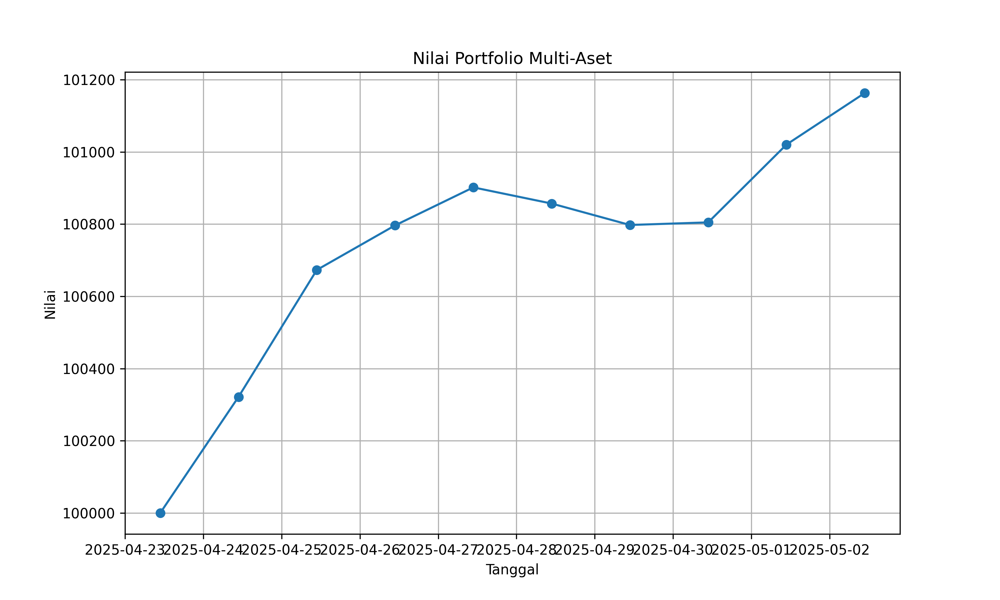
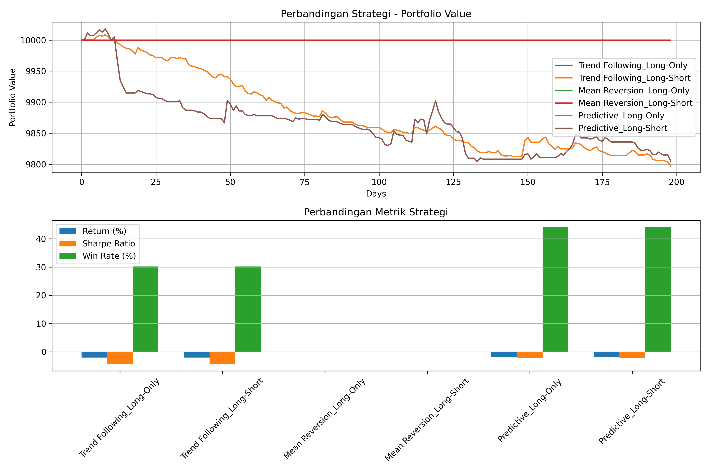
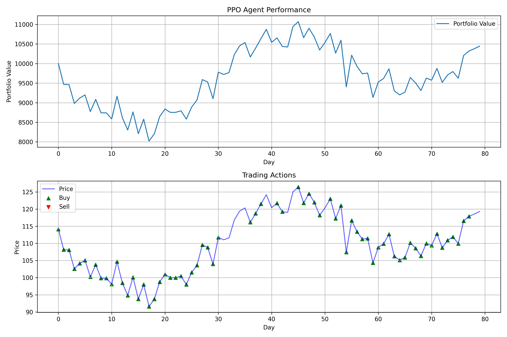

[](https://ko-fi.com/N4N51EF9I0)


# AI Hedge Fund

An artificial intelligence system for portfolio management and automated trading based on **PyTorch** with high adaptability to various market conditions.

<div align="center">
  
  <p><em>AI Hedge Fund System Performance on Integrated Testing</em></p>
</div>

## Description

AI Hedge Fund is an advanced algorithmic trading platform that combines adaptive risk management, multi-asset trading, machine learning models, and automated trading strategies. This system is designed to optimize investment decisions through a combination of traditional trading algorithms and modern artificial intelligence techniques.

This system is an evolution from a simple stock price prediction model, which has now become a complete trading platform with risk management capabilities, multi-asset support, and advanced machine learning.

## Key Features

### 1. Adaptive Risk Management
- **Dynamic Stop Loss**: Automatic loss limits based on asset volatility
- **Trailing Stop**: Automatically locks in profits as price moves favorably
- **Volatility-Based Position Sizing**: Adjusts position size based on market risk level
- **Drawdown Analysis**: Reduces exposure when portfolio experiences consecutive losses

### 2. Multi-Asset Trading
- **Dynamic Capital Allocation**: Distributes capital based on opportunities and risks
- **Multiple Asset Class Support**: Stocks, forex, crypto, commodities, and more
- **Partial Positions**: Ability to open/close partial positions for better risk management
- **Short Selling**: Capitalize on opportunities in bearish markets

### 3. Advanced Trading Strategies
- **Trend Following**: Follow price momentum with technical indicators
- **Mean Reversion**: Capitalize on price movements returning to the mean
- **Predictive**: Use machine learning models for price prediction
- **PPO (Proximal Policy Optimization)**: Reinforcement learning-based decision making

### 4. Comprehensive Technical Analysis
- **30+ Technical Indicators**: RSI, MACD, Bollinger Bands, ATR, and many more
- **Candlestick Pattern Analysis**: Detection of classic candlestick patterns
- **Volume Analysis**: Price movement confirmation with volume
- **Volatility Metrics**: Measurement and analysis of volatility across various timeframes

### 5. Backtesting and Evaluation
- **Realistic Historical Simulation**: Including slippage and transaction costs
- **Comprehensive Performance Metrics**: Sharpe ratio, max drawdown, win rate, etc.
- **Result Visualization**: Comparison charts and visual analysis
- **What-If Analysis**: Testing various parameters and market scenarios

### 6. PatchTST Model (PyTorch)
- **PatchTST**: Patch-based transformer model for time series forecasting, highly effective for financial data and stock price prediction.
- **Advantages**: More efficient and accurate on long time series data, supports hyperparameter tuning with Optuna.
- **Tuning**: Supports Bayesian optimization and grid search for hyperparameter tuning.
- **Code Documentation**: [src/models/patchtst_model.py](src/models/patchtst_model.py)

### 7. Interactive CLI Display
- **Rich Terminal UI**: Beautiful CLI display with progress bars, spinners, and colored tables
- **Loading Animation**: Real-time progress bar during training and prediction
- **PPO Trading Signals**: Automatic trading signals with confidence levels

## Detailed Usage

### Installation

```bash
# Clone repository
git clone https://github.com/cyclocerine/HedgeFund.git
cd HedgeFund

# Create virtual environment (optional but recommended)
python -m venv venv
source venv/bin/activate  # Linux/Mac
# or
venv\Scripts\activate     # Windows

# Install dependencies
pip install -r requirements.txt
```

### Running the GUI Application

The GUI application provides a complete visual interface to interact with the system:

```bash
python scripts/run_app.py
```

Through the GUI, you can:
- Select assets to analyze
- View predictions and trading signals
- Run backtesting with various strategies
- Monitor portfolio performance
- Adjust risk management parameters

### Running the Command-Line Application

CLI with interactive display and progress bar:

```bash
# Stock price prediction (default: 6 years of data)
python scripts/run_cli.py --ticker AAPL --mode predict --forecast-days 20

# Prediction with hyperparameter tuning
python scripts/run_cli.py --ticker MSFT --mode predict --tune --forecast-days 20 --save-results

# Prediction with PPO trading signals
python scripts/run_cli.py --ticker AAPL --mode predict --ppo --forecast-days 10

# Backtest with strategy
python scripts/run_cli.py --ticker AAPL --mode backtest --strategy Predictive

# Prediction with custom period
python scripts/run_cli.py --ticker AAPL --mode predict --start-date 2020-01-01 --end-date 2024-12-31
```

#### CLI Output Example:

```
+============================================================+
|  STOCK PRICE PREDICTION APPLICATION                        |
|  PatchTST Deep Learning | PPO Trading | CUDA               |
+============================================================+

  [OK] Data ready!            ================= 100% 0:00:00
  [OK] Model trained (27.1s)  ================= 100% 0:00:27
  [OK] Prediction complete!   ================= 100% 0:00:00
  [OK] Evaluation complete!   ================= 100% 0:00:00

  Predictions for Upcoming Days
  +------+-------------+------------+
  | Day  |       Price |    Trend   |
  +------+-------------+------------+
  |  1   |   $150.25   |            |
  |  2   |   $152.11   | [+] +1.24% |
  |  3   |   $151.85   | [-] -0.17% |
  +------+-------------+------------+

  +--------------------------------------+
  |  ** COMPLETE **                      |
  |  Thank you for using!                |
  +--------------------------------------+
```

### CLI Parameters

| Argument          | Description                             | Example                   |
|-------------------|-----------------------------------------|---------------------------|
| `--ticker`        | Stock/commodity symbol                  | `AAPL`, `MSFT`            |
| `--mode`          | Operation mode                          | `predict`, `backtest`     |
| `--start-date`    | Start date (YYYY-MM-DD)                 | `2020-01-01`              |
| `--end-date`      | End date                                | `2024-12-31`              |
| `--model`         | Model type (only `patchtst`)            | `patchtst`                |
| `--lookback`      | Number of historical days for input     | `60`                      |
| `--forecast-days` | Number of days to forecast              | `20`                      |
| `--tune`          | Enable hyperparameter tuning            | (flag)                    |
| `--ppo`           | Enable PPO trading signals              | (flag)                    |
| `--save-results`  | Save results to file                    | (flag)                    |
| `--strategy`      | Select strategy (for backtest)          | `Trend Following`, `PPO`  |
| `--initial-balance`| Initial capital for backtest           | `10000000`                |
| `--optimize`      | Optimize strategy parameters            | (flag)                    |


#### 1. Single Strategy Backtesting

```python
from src.trading import Backtester
from src.models import StockPredictor
import matplotlib.pyplot as plt

# Load and predict data
predictor = StockPredictor(ticker="AAPL", start_date="2022-01-01")
predictor.load_data()
predictor.train_model(model_type="ensemble")
actual_prices = predictor.y_test
predicted_prices = predictor.predict()
dates = predictor.test_dates

# Setup and run backtest
backtester = Backtester(
    actual_prices=actual_prices,
    predicted_prices=predicted_prices,
    initial_investment=10000000,
    transaction_fee=0.001,
    dates=dates
)

portfolio_values, trades, performance = backtester.run(
    strategy="Predictive",
    allow_short=True,
    max_position_size=0.5
)

# Display results
print(f"Return: {performance['total_return']:.2f}%")
print(f"Sharpe Ratio: {performance['sharpe_ratio']:.4f}")
print(f"Max Drawdown: {performance['max_drawdown']:.2f}%")
print(f"Win Rate: {performance['win_rate']:.2f}%")
print(f"Trades: {performance['num_trades']}")

# Visualize results
fig = backtester.plot_results(benchmark=actual_prices)
plt.show()
```

#### 2. Multi-Asset Trading with Risk Management

```python
from src.trading import MultiAssetPortfolio, RiskManager
from datetime import datetime

# Initialize risk manager
risk_manager = RiskManager(
    max_drawdown=0.1,
    max_position_size=0.2, 
    stop_loss=0.05,
    trailing_stop=0.03
)

# Initialize portfolio
portfolio = MultiAssetPortfolio(
    assets=["AAPL", "MSFT", "GOOGL", "BTCUSDT"],
    initial_capital=100000000,
    transaction_fee=0.001
)

# Current prices
current_prices = {
    "AAPL": 150.25,
    "MSFT": 270.50,
    "GOOGL": 125.75,
    "BTCUSDT": 43500
}

# Calculate volatility (in real implementation, use historical data)
volatilities = {
    "AAPL": 0.02,
    "MSFT": 0.01,
    "GOOGL": 0.025,
    "BTCUSDT": 0.04
}

# Create trading signals
signals = []
for symbol, volatility in volatilities.items():
    # Example: buy low volatility assets, short high volatility ones
    if volatility < 0.02:
        # Calculate position size based on volatility
        position_size = risk_manager.size_position(
            'BUY', current_prices[symbol], portfolio.cash, volatility
        )
        signals.append({
            'symbol': symbol,
            'action': 'BUY',
            'size': position_size,
            'volatility': volatility
        })
    elif volatility > 0.03:
        position_size = risk_manager.size_position(
            'SHORT', current_prices[symbol], portfolio.cash, volatility
        )
        signals.append({
            'symbol': symbol,
            'action': 'SHORT',
            'size': position_size,
            'volatility': volatility
        })

# Execute transactions
result = portfolio.allocate_capital(signals, current_prices, datetime.now())

# View results
print(f"Trades Executed: {len(result['executed_orders'])}")
print(f"Portfolio Value: {result['portfolio_value']:.2f}")

# View active positions
positions_df = portfolio.get_positions_df()
print("\nActive Positions:")
print(positions_df)
```

#### 3. Using PPO Agent with Technical Indicators

```python
from src.trading import PPOTrader
from src.data.indicators import add_technical_indicators
import pandas as pd
import yfinance as yf
import matplotlib.pyplot as plt

# Download data
data = yf.download("AAPL", period="1y")

# Add technical indicators
data = add_technical_indicators(data)

# Select subset of indicators for PPO Agent state
feature_columns = ['RSI', 'MACD', 'MACD_Signal', 'ATR_14', 
                   'BB_Width', 'Volatility_20', 'SMA_Cross', 'Daily_Return']

# Remove rows with NaN (indicators require historical data)
data = data.dropna(subset=feature_columns)

# Setup PPO Trader
ppo_trader = PPOTrader(
    prices=data['Close'].values,
    features=data[feature_columns].values,
    initial_investment=10000000
)

# Train PPO Agent
print("Training PPO Agent...")
train_results = ppo_trader.train(episodes=50)

# Backtest
backtest_results = ppo_trader.backtest()

# Visualize results
plt.figure(figsize=(12, 8))

# Plot portfolio value
plt.subplot(2, 1, 1)
plt.plot(backtest_results['portfolio_values'], label='Portfolio Value')
plt.title('PPO Agent Performance')
plt.xlabel('Day')
plt.ylabel('Value')
plt.grid(True)
plt.legend()

# Plot trading signals
plt.subplot(2, 1, 2)
plt.plot(data['Close'][-len(backtest_results['actions']):].values, label='Price')

# Mark buy/sell actions
for i, action in enumerate(backtest_results['actions']):
    if action == 1:  # Buy
        plt.scatter(i, data['Close'][-len(backtest_results['actions'])+i], 
                   color='green', marker='^')
    elif action == 2:  # Sell
        plt.scatter(i, data['Close'][-len(backtest_results['actions'])+i], 
                   color='red', marker='v')

plt.title('Trading Signals')
plt.xlabel('Day')
plt.ylabel('Price')
plt.grid(True)

plt.tight_layout()
plt.show()
```

## System Architecture

AI Hedge Fund is built with a modular architecture that allows flexibility and extension:

```
+-------------------------------------------------------------------+
|                          AI Hedge Fund                            |
+---------------+-----------------------------------+---------------+
                |                                   |
+---------------v---------------+     +-------------v---------------+
|      Data Processing Layer    |     |     Trading Engine Layer    |
|                               |     |                             |
|  +-------------------------+  |     |  +-------------------------+|
|  |    Data Collection      |  |     |  |    Strategy Engine      ||
|  +-------------------------+  |     |  +-------------------------+|
|  +-------------------------+  |     |  +-------------------------+|
|  |  Feature Engineering    |  |     |  |      Risk Manager       ||
|  +-------------------------+  |     |  +-------------------------+|
|  +-------------------------+  |     |  +-------------------------+|
|  |   Technical Indicators  |  |     |  |   Portfolio Manager     ||
|  +-------------------------+  |     |  +-------------------------+|
+-------------------------------+     +-----------------------------+
                |                                   |
+---------------v---------------+     +-------------v---------------+
|    Prediction Models Layer    |     |     Evaluation Layer        |
|                               |     |                             |
|  +-------------------------+  |     |  +-------------------------+|
|  |     LSTM Predictor      |  |     |  |      Backtesting        ||
|  +-------------------------+  |     |  +-------------------------+|
|  +-------------------------+  |     |  +-------------------------+|
|  |    Ensemble Models      |  |     |  |   Performance Metrics   ||
|  +-------------------------+  |     |  +-------------------------+|
|  +-------------------------+  |     |  +-------------------------+|
|  |      PPO Agent          |  |     |  |     Visualization       ||
|  +-------------------------+  |     |  +-------------------------+|
+-------------------------------+     +-----------------------------+
```

## Test Results

Comprehensive testing has been performed on all system components:

### RiskManager Performance

<div align="center">
  
  <p><em>Portfolio performance with adaptive risk management shows positive returns and minimal drawdown</em></p>
</div>

Testing shows that RiskManager works well in:
- Adjusting position size based on volatility (0.2 at low volatility vs 0.025 at high volatility)
- Generating timely stop loss and trailing stop signals
- Limiting maximum portfolio drawdown

### Trading Strategy Comparison

<div align="center">
  
  <p><em>Performance comparison of various trading strategies across different market conditions</em></p>
</div>

Results show that:
- Predictive strategy yields the highest win rate (44.12%)
- Trend Following strategy is more active with the most trades (127)
- Mean Reversion strategy is effective during sideways market periods

### PPO Agent Performance

<div align="center">
  
  <p><em>PPO Agent performance with technical indicators - Return 4.44%, Sharpe Ratio 0.53</em></p>
</div>

PPO Agent demonstrates:
- Adaptability to various market conditions
- Positive return of 4.44% with Sharpe Ratio of 0.53
- Optimal trading decisions based on rich state with technical indicators

For more complete testing documentation, please see [TESTING_GUIDE.md](TESTING_GUIDE.md) and [BUGFIX_REPORT.md](BUGFIX_REPORT.md).

## Main Components

### 1. RiskManager 

```python
from src.trading.risk_manager import RiskManager

# Usage example
risk_manager = RiskManager(
    max_drawdown=0.1,        # Maximum allowed drawdown (10%)
    max_position_size=0.2,   # Maximum position size (20% of portfolio)
    stop_loss=0.05,          # Default stop loss (5%)
    trailing_stop=0.03       # Trailing stop (3%)
)

# Determine position size based on volatility
position_size = risk_manager.size_position(
    action='BUY',           # BUY or SHORT
    price=150.25,           # Asset price
    available_capital=10000, # Available capital
    volatility=0.02         # Historical volatility
)
```

### 2. MultiAssetPortfolio

```python
from src.trading.portfolio import MultiAssetPortfolio

# Initialize portfolio
portfolio = MultiAssetPortfolio(
    assets=['AAPL', 'MSFT', 'GOOGL'],  # List of assets in portfolio
    initial_capital=100000,            # Initial capital
    transaction_fee=0.001              # Transaction fee (0.1%)
)

# Example trading signals
signals = [
    {'symbol': 'AAPL', 'action': 'BUY', 'size': 0.15, 'volatility': 0.01},
    {'symbol': 'MSFT', 'action': 'SHORT', 'size': 0.1, 'volatility': 0.015}
]

# Current prices
current_prices = {'AAPL': 150.25, 'MSFT': 270.50, 'GOOGL': 2500.75}

# Execute capital allocation
result = portfolio.allocate_capital(signals, current_prices, timestamp=datetime.now())

# Get portfolio metrics
summary = portfolio.get_portfolio_summary()
positions = portfolio.get_positions_df()
transactions = portfolio.get_transactions_df()
history = portfolio.get_portfolio_history_df()
```

### 3. Backtester

```python
from src.trading.backtest import Backtester

# Initialize backtester
backtester = Backtester(
    actual_prices=prices,             # Array of actual prices
    predicted_prices=predictions,     # Array of predicted prices
    initial_investment=10000,         # Initial investment
    transaction_fee=0.001,            # Transaction fee
    dates=dates                       # Array of dates (optional)
)

# Run backtest
portfolio_values, trades, performance = backtester.run(
    strategy="Trend Following",       # Trading strategy
    allow_short=True,                 # Allow short selling
    max_position_size=0.5             # Maximum position size
)

# Visualize results
backtester.plot_results(benchmark=benchmark_prices)
```

### 4. PPO Agent

```python
from src.trading.ppo_agent import PPOTrader

# Initialize PPO Trader
ppo_trader = PPOTrader(
    prices=prices,                   # Array of historical prices
    features=features,               # Array of features/technical indicators
    initial_investment=10000         # Initial investment
)

# Train model
train_results = ppo_trader.train(
    episodes=100,                    # Number of training episodes
    max_steps=None                   # Step limit per episode
)

# Run backtest
backtest_results = ppo_trader.backtest()

# Access results
portfolio_values = backtest_results['portfolio_values']
trades = backtest_results['trades']
performance = backtest_results['performance']
actions = backtest_results['actions']  # 0=hold, 1=buy, 2=sell
```

## Use Case Examples

### Forex Trading (EUR/USD)

```python
from src.trading import Backtester, TradingStrategy
import yfinance as yf
import matplotlib.pyplot as plt

# Download EUR/USD data
data = yf.download('EURUSD=X', period='1y')
prices = data['Close'].values
dates = data.index.tolist()

# Create simple prediction (example: lag 1-day as prediction)
predicted_prices = prices.copy()
predicted_prices = np.roll(predicted_prices, -1)
predicted_prices[-1] = predicted_prices[-2]  # Fix last value

# Run backtest
backtester = Backtester(
    actual_prices=prices,
    predicted_prices=predicted_prices,
    initial_investment=100000,  # $100,000
    transaction_fee=0.0005,     # 0.05% fee
    dates=dates
)

# Test various strategies
strategies = ["Trend Following", "Mean Reversion", "Predictive"]
results = {}

for strategy in strategies:
    portfolio_values, trades, performance = backtester.run(
        strategy=strategy,
        allow_short=True,
        max_position_size=0.3
    )
    results[strategy] = (portfolio_values, performance)
    
    print(f"\nStrategy: {strategy}")
    print(f"Return: {performance['total_return']:.2f}%")
    print(f"Sharpe Ratio: {performance['sharpe_ratio']:.4f}")
    print(f"Win Rate: {performance['win_rate']:.2f}%")
    print(f"Trades: {performance['num_trades']}")

# Visualize comparison
plt.figure(figsize=(12, 6))
for strategy, (values, _) in results.items():
    plt.plot(dates[-len(values):], values, label=strategy)

plt.title('Trading Strategy Comparison EUR/USD')
plt.xlabel('Date')
plt.ylabel('Portfolio Value (USD)')
plt.legend()
plt.grid(True)
plt.show()
```

## Future Work

Some developments planned for the next version:

1. **Trading API Integration**
   - Direct connection to brokers (Interactive Brokers, Alpaca, Binance)
   - Automatic order execution based on signals

2. **Machine Learning Improvements**
   - Implementation of more advanced Deep Reinforcement Learning
   - Transfer learning for cross-asset market adaptation

3. **Data Enrichment**
   - Sentiment analysis integration from news and social media
   - Fundamental data for mixed fundamental-technical strategies

4. **Parameter Optimization**
   - Implementation of Bayesian Optimization for hyperparameter tuning
   - Walk-forward optimization for more robust validation

5. **UI Development**
   - Real-time dashboard for portfolio monitoring
   - Mobile app for monitoring and notifications

## License

[MIT](LICENSE)

## Contributors

Contributions are always welcome! Please:
- Open an issue to report bugs or propose features
- Submit a pull request for fixes or feature additions
- Share test results on various assets and market conditions

## References

- Chan, E. P. (2013). *Algorithmic Trading: Winning Strategies and Their Rationale*
- Sutton, R. S., & Barto, A. G. (2018). *Reinforcement Learning: An Introduction*
- De Prado, M. L. (2018). *Advances in Financial Machine Learning*
- Murphy, J. J. *Technical Analysis of the Financial Markets*

---
[](https://ko-fi.com/N4N51EF9I0)
<div align="center">
  <p><strong>AI Hedge Fund</strong> - Intelligent Algorithmic Trading for the Digital Era</p>
</div> 
